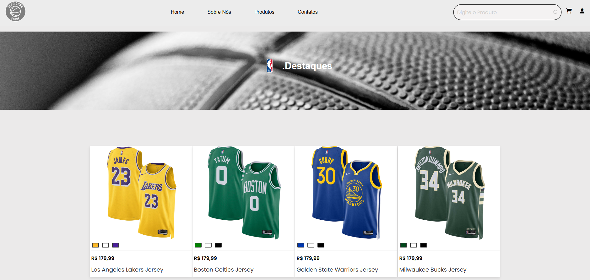
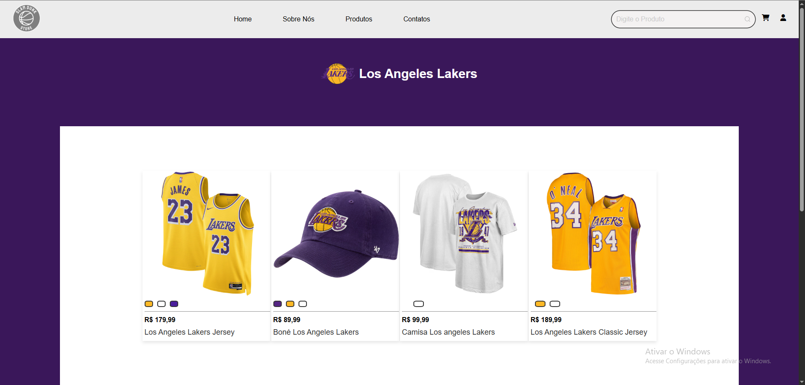
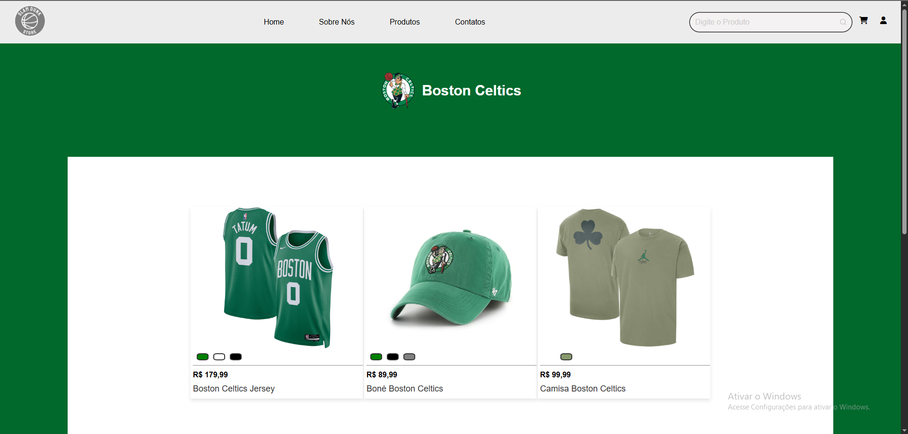
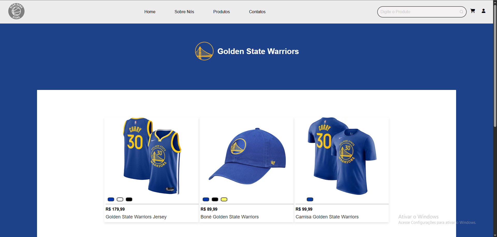
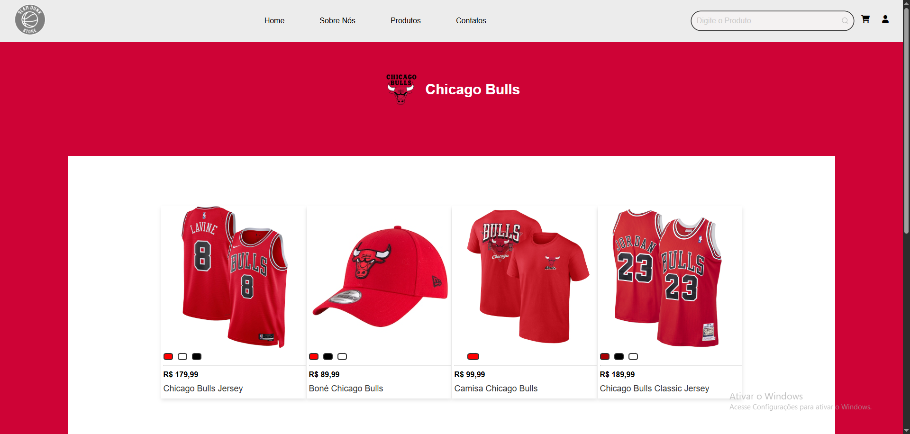
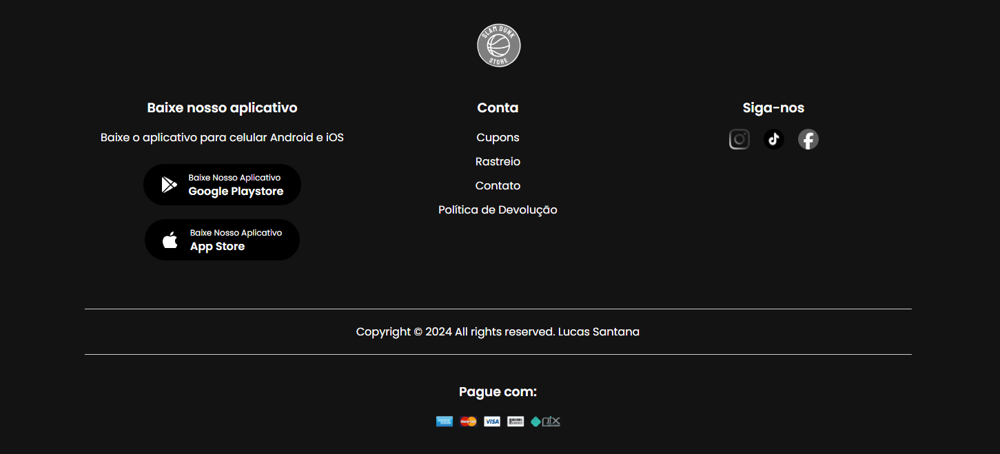

# SlamDunk-Store🏀

O projeto Slam Dunk Store é uma loja virtual fictícia desenvolvida com HTML, CSS e JavaScript, focada na venda de produtos relacionados ao basquete, como regatas, bonés e camisas dos times da NBA. O site foi projetado para ser totalmente responsivo, oferecendo uma experiência de navegação agradável, moderna e organizada. Este projeto demonstra habilidades em desenvolvimento front-end, usabilidade e design visual.

Esta também foi minha primeira experiência na área de programação!!


## Funcionalidades 🌟

- **Layout responsivo**: adaptado para desktop e dispositivos móveis.
- **Barra de navegação interativa**: com links rápidos para Home, Sobre Nós, Produtos e Contatos.
- **Sistema de busca**: campo de pesquisa de produtos na própria navegação.
- **Carrossel de banners**: destaques visuais rotativos na página inicial.
- **Catálogo de produtos**: dividido em categorias como regatas, bonés, camisas e linha retrô.
- **Visualização por times**: logos da NBA que direcionam para produtos de cada equipe.
- **Troca de cores do produto**: botão interativo que muda as imagens do produto com diferentes variações de cor.
- **Simulação de carrinho**: link com ícone de carrinho (pronto para futuras implementações).
- **Área de avaliações**: seção com feedback de clientes fictícios.
- **Links de redes sociais**: integração com Instagram, TikTok e Facebook.
- **Seção de download do aplicativo (fictício)**: botões para Play Store e App Store.
- **Rodapé completo**: informações de conta, formas de pagamento aceitas e política de devolução.

## Tela Inicial 📸


## 📂 Estrutura do Projeto

**SlamDunk Store/**<br> <br>
├── index.html  # **Página principal do site** <br><br>
               ├── css/ <br>
                &#8287;&#8287;&#8287;&#8287;&#8287;&#8287;&#8287;&#8287;└──main.css # **Estilos principais** <br>
                &#8287;&#8287;&#8287;&#8287;&#8287;&#8287;&#8287;&#8287;&#8287;&#8287;&#8287;&#8287;└── carrinho.css  # **Estilo da página do carrinho** <br><br>
                &#8287;&#8287;&#8287;&#8287;&#8287;&#8287;&#8287;&#8287;&#8287;&#8287;&#8287;&#8287;└── contatos.css  # **Estilo da página de contatos** <br><br>
                &#8287;&#8287;&#8287;&#8287;&#8287;&#8287;&#8287;&#8287;&#8287;&#8287;&#8287;&#8287;└── produtos.css  # **Estilo da página da produtos** <br><br>
                &#8287;&#8287;&#8287;&#8287;&#8287;&#8287;&#8287;&#8287;&#8287;&#8287;&#8287;&#8287;└── sobre.css  # **Estilo da página sobre nós** <br><br>
                &#8287;&#8287;&#8287;&#8287;&#8287;&#8287;&#8287;&#8287;&#8287;&#8287;&#8287;&#8287;└── usuario.css  # **Estilo da página usuario** <br><br>
              ├── js/ # **Códigos utilizados para gerar interatividade do site<br>
                 &#8287;&#8287;&#8287;&#8287;&#8287;&#8287;&#8287;&#8287;└── slides_de_imagens.js **Scripts responsável pelo carrosel de imagens do banner principal** <br>
                  &#8287;&#8287;&#8287;&#8287;&#8287;&#8287;&#8287;&#8287;&#8287;&#8287;&#8287;└── usuario.js  # **Interatividade na página do usuário** <br>
                    &#8287;&#8287;&#8287;&#8287;&#8287;&#8287;&#8287;&#8287;&#8287;&#8287;&#8287;&#8287;&#8287;&#8287;└── times.js  # **Permite trocar as cores e imagem do produto de forma interativa.** <br>
                     &#8287;&#8287;&#8287;&#8287;&#8287;&#8287;&#8287;&#8287;&#8287;&#8287;&#8287;&#8287;&#8287;&#8287;&#8287;&#8287;&#8287;└── times-produto.js  # **Permite trocar as cores e imagem do produto de forma interativa na página de compra.** <br>
                      &#8287;&#8287;&#8287;&#8287;&#8287;&#8287;&#8287;&#8287;&#8287;&#8287;&#8287;&#8287;&#8287;&#8287;&#8287;&#8287;&#8287;&#8287;&#8287;&#8287;└── produto.js  # **Cria a interatividade da página de compra do produto** <br><br>
              ├── imagens/  # **Imagens utilizadas no site** <br>
                 &#8287;&#8287;&#8287;&#8287;&#8287;&#8287;&#8287;&#8287;└── icon-logo.png <br>
                  &#8287;&#8287;&#8287;&#8287;&#8287;&#8287;&#8287;&#8287;&#8287;&#8287;&#8287;&#8287;└── LOGAO.png <br>
                     &#8287;&#8287;&#8287;&#8287;&#8287;&#8287;&#8287;&#8287;&#8287;&#8287;&#8287;&#8287;&#8287;&#8287;&#8287;&#8287;&#8287;└── banner.png <br>
                      &#8287;&#8287;&#8287;&#8287;&#8287;&#8287;&#8287;&#8287;&#8287;&#8287;&#8287;&#8287;&#8287;&#8287;&#8287;&#8287;&#8287;&#8287;&#8287;&#8287;&#8287;&#8287;&#8287;&#8287;└── ... (dentre outras imagens) <br>
<br>

## Tela Abaixo 📸



## 🚀 Tecnologias Usadas
<p>O projeto foi desenvolvido utilizando as seguintes linguagens e tecnologias:</p>
<div>
  
  
  
</div>

## Página dos Times 🏀

<p align="center">
  
  
  
  
</p>


## Rodapé 📸



## 🛠️ Como Executar o Projeto

1. Clone este repositório:
   ```bash
   git clone https://github.com/Lucas11santana/SlamDunk-Store.git

